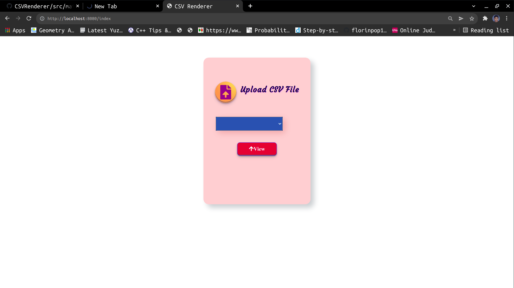
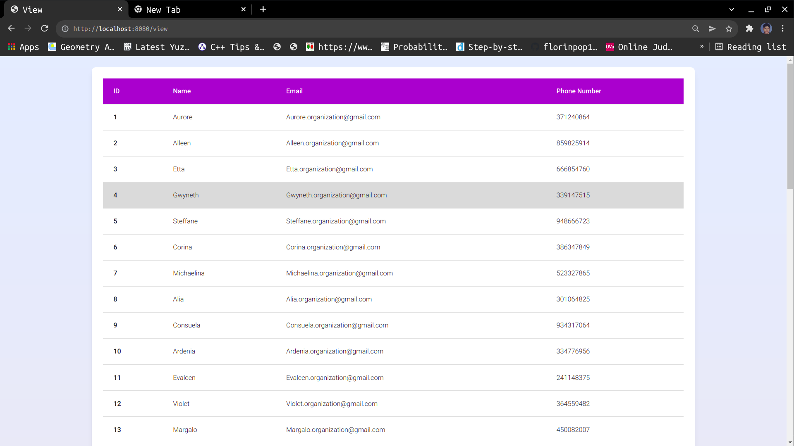

# CSVRenderer
Java Web application based on SpringBoot, Hibernate, Thymeleaf, HTML and CSS 
to read, store and Render CSV Files. The project uses Jackson FasterXML CSV parser to parse the csv files and store 
in database.

For demonstration [Demo](https://drive.google.com/file/d/1VJbaH96z1AkvHZSQ_IfaeXS5nslTBmfo/view?usp=sharing)

#### UML data model

<div>
    
</div>

## Directory Structure

```
 📦src
 ┣ 📂main
 ┃ ┣ 📂java.com.fossee.csvmanager
 ┃ ┃ ┣ 📂controller
 ┃ ┃ ┃ ┗ 📜CSVController.java
 ┃ ┃ ┣ 📂model
 ┃ ┃ ┃ ┣ 📜CsvDocument.java
 ┃ ┃ ┃ ┗ 📜CsvFile.java
 ┃ ┃ ┣ 📂repository
 ┃ ┃ ┃ ┣ 📜CsvDocumentRepository.java
 ┃ ┃ ┃ ┗ 📜CsvFileRepository.java
 ┃ ┃ ┣ 📂service
 ┃ ┃ ┃ ┗ 📜CsvService.java
 ┃ ┃ ┣ 📂util
 ┃ ┃ ┃ ┣ 📜CsvManager.java
 ┃ ┃ ┃ ┗ 📜FileForm.java
 ┃ ┃ ┗ 📜CsvManagerApplication.java
 ┃ ┃
 ┃ ┗ 📂resources
 ┃ ┃ ┣ 📂static
 ┃ ┃ ┃ ┣ 📂assets
 ┃ ┃ ┃ ┃ ┗ 📜logo.png
 ┃ ┃ ┃ ┗ 📂styles
 ┃ ┃ ┃ ┃ ┣ 📜style.css
 ┃ ┃ ┃ ┃ ┗ 📜viewRender.css
 ┃ ┃ ┣ 📂templates
 ┃ ┃ ┃ ┣ 📜errorPage.html
 ┃ ┃ ┃ ┣ 📜index.html
 ┃ ┃ ┃ ┗ 📜viewRender.html
 ┃ ┃ ┗ 📜application.properties
 ┗ 📂test
 ┃ ┗ 📂java
 ┃ ┃ ┗ 📂com.fossee.csvmanager
 ┃ ┃    ┣ 📜CsvManagerApplicationTests.java
 ┃ ┃    ┗ 📜UserRepositoryTests.java

```

# Building

Clone this project and ```cd CSVRenderer``` and then open the project in your favourite IDE. The IDE will
build the maven project or if you have ```maven``` installed in your local system. Then from command line
```cd CSVRenderer``` and then run ``` maven clean install ```

# Features and Output

### Index Page

<div>
    
</div>

### Rendered View

<div>
    
</div>
